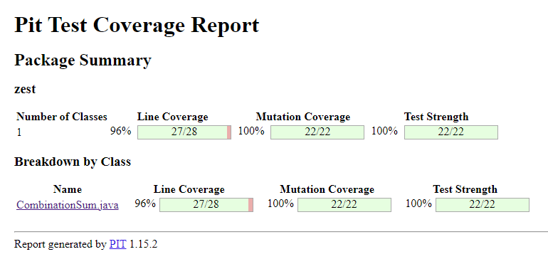
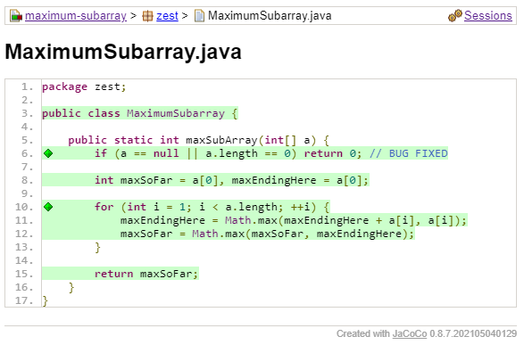

## atoi
**Specification-based testing** 
Input variable: string to be converted (type String), output variable: 32-bit signed integer ([-2^31, 2^31-1])

Per the specification, any string whose integer is contained in the specified range of [-2^31, 2^31 - 1] would be a valid input, however, there are corner cases.
1. Null must return output 0 (wouldn't be convertible)
2. Leading whitespaces must be removed before parsing.
3. String is stopped parsing as soon as a non-digit character is reached. This includes strings only containing non-digit characters or spaces (empty string).
4. Strings whose integer value exceed the integer range must be clamped to the next closest integer when being converted.

First, I tested the special cases null, empty string and leading spaces. Even though it is not specified, I wrote a test for the case of trailing spaces as well
because those are equally meaningless when converting to an integer as spaces can't be converted logically. I further added one for both leading and trailing spaces.
Another case listed in the specifiication required stopping parsing when non-digit characters are reached. I tested by this adding spaces in between but also including 
digits in between letters. Due to that specification, I verified that spaces after +/- signs also produce special case output 0.
Lastly, I tested the boundaries with integers out of the specified, possible range before testing a normal case where the conversion faces no exceptions for cases with 
the signs specified and without. This gave 96% test coverage with the 4% missing being caused due to the class name .

**Structural testing** 
Specification-based testing already provided the necessary coverage (ignoring the class name issue)

**Mutation testing**

## combination_sum
**Specification-based testing**
Input variable: array of integers + target integer, output variable: list of integer lists 

**Structural testing**
Based on the specification, unique combinations of numbers summing up to the target value have to returned. This
makes empty list and null invalid inputs and an empty list should be returned as output in those cases. Hence, I tested
those cases. Further, they specified that numbers can be used multiple times when summing up to a target. To test this, 
I wrote a test case using a candidate set with 1 in it to verify that the combination of only ones appears. Additionally,
I checked for the case where target appears in the candidates and hence the target itself should be included in the result
as a possible "sum". Another similar case which included having to bug fix and modify the code was the case of a zero being
a possible candidates. For this, I used the assumption in the specification of 149 being the maximum number of combinations
returned. Finally, I tested a normal, simple case.
This resulted in 97% test coverage  with the 3% being caused by the modified code and the class
name. However, everything important has been covered.

**Mutation testing**

100% mutation test coverage with the line coverage being not 100% due to the class line issue

## frac2dec

## generate_parentheses

## maximum_subarray
The maximum subarray problem is to find the subarray with the largest sum of contiguous numbers.

**Specification-Based Testing:** First, we started to test special cases. These are a null input and an empty array (which should return 0, according to the specification).
Then, we tested an array with a single element, which should return the element itself.
After that, an array of length 2 was tested, with both positive and negative numbers.
Then, we tested an array with all positive numbers, followed by all zeroes.
Finally, we tested arbitrary arrays,  where the largest subarray is at the beginning, in the middle, at the end and one case where it occurs twice.

**Bugs found:** We found an inconsistency between the specification and code. The specification said that an empty array should return 0 - but the code only throws an ArrayIndexOutOfBoundsException.
We also included a check for a null input, also just returning 0 instead of a NullPointerException.
With this change, all tests passed.

**Structural Testing:**
With the specification-based testing, we did almost reach 100% coverage. The only uncovered "instruction" was line 3, the class itself respectively its instantiation.   
After creating the test to check whether the instantiated MaximumSubarray class is not null, we reached 100% coverage.
The test is not really needed if we'd not care about coverage criteria, as it is a given that the class is not null.\

**Mutation Testing:**
As you can see in the screenshot below, there are no surviving mutants, i.e. we reached 100% mutation coverage.\

## median_of_arrays
The median of two arrays problem is to find the median of two sorted arrays.

**Specification-Based Testing:** First, we again tested some special cases.
These are empty arrays, null arrays, unsorted arrays and tested whether negative sorting is correct (-5, -4, -3 and not -1, -2, -3).
Then, we tested the boundaries: arrays with a single element and arrays with two elements. 
We also tested negative number arrays and a test for MAX_VALUE and MIN_VALUE.

**Bugs found:** The specification does not say what should happen when both arrays are empty.
When executing the method, it returns -1. We allowed that, even though it would make sense to return 0.
It would be simple to change that: just add a guard clause to check if both arrays are empty and return 0.\
Further, the variables tmp are unused. But the code still works without them being used. It would be possible to remove the tmp variables.\
Other than that , we did not find any bugs.

**Structural Testing:** After doing the specification-based testing, we reached almost 100% coverage.
The only uncovered element is in line 30, we only had tests with the second input being unsorted. After having a test with the first input unsorted, we reached 100% coverage.\

**Mutation Testing:**
We did not reach 100% mutation coverage. We killed 40 out of 46 mutants. We now describe one of the mutants per category (mutants in 3 different categories survived):\
**Negated conditional:** A surviving mutant is in the first line of the `getMin` method (line 7). The condition is negated (by adding a !) and the tests still pass. As this is a helper method, it might be worth testing it. But implicitly, the test suite already tests this method thoroughly.\
**Changed conditional boundary:** Another surviving mutant is in the second line of the `isArraySorted` "helper" method (line 19). It likely changes >= to >. This means that we did not have a test where two subsequent elements in the array are the same. This would be a good test to implement.\
**Replaced integer addition with subtraction:** In line 4 of the `findMedianSortedArrays` method (line 32), a mutant survived. The m + n is changed to m - n, and the tests still pass. This is correct. m + n % X is the same as m - n % X. Therefore, it does not make sense to create a test for this mutant.\

## needle_in_hay

#### Specification-Based Testing

First I read the specs, and created a simple test case to explore how it works.

Then I identified the partitions, some of which were already described in the specification (any string null, both inputs empty). I then combined the partitions for the inputs to create test cases. If one of the inputs was exceptional (null, empty string), I wrote a single test for it.

After that I wrote tests for the case that the needle is or is not in the haystack. For this I took into account the partitions I created (in this case 1 char string, longer string) and added other test cases based on instinct (needle present multiple times).

I found that if the haystack was not an empty String but the needle was, an exception was thrown. I fixed this by adding another guard clause for this test.

#### Structural Testing

With the test written based on the specifications, I already achieved 100% condition+branch coverage.

#### Mutation Testing

The existing tests were able to catch 100% of the generated mutants.

## palindrome

#### Specification-Based Testing

After reading the description, I split up the test into partitions.
The first partition was from the lower bound (-2^20) to -1,
and the second was from 0 to upper bound (2^20).

Then I further split them up into single digit and multiple digit partitions.

For the single digit success case, I tested the on point (0) and another case.
For the multiple digits success case, I tested an even and an uneven number of digits.

For the negative numbers, I tested the negatives of palindromes (taken from above),
and a negative number whose positive also wasn't a palindrome.

I then also tested positive numbers that weren't palindromes.

Then I wrote tests for the boundaries.

Finally, I added tests for palindromes that were close to the boundaries
(i.e., same number of digits) due to personal judgement.

I used the same tests for both palindrome implementations.
For PalindromeTwo, I discovered that the test case with 0 failed.
I fixed it by adding another clause to test for single digits.

#### Structural Testing

For PalindromeOne I already achieved 100% coverage.

For PalindromeTwo I had 90% coverage. I added a test for 999 to test the long conditional,
as this was a path returning true I had not covered but found important.
I also added a test for 9, as single to multiple digits was a boundary that I missed.
There remained two cases, but as the condition was already covered
and I didn't find a test case for them within a reasonable time frame, I skipped them.

#### Mutation Testing

For PalindromeOne my tests killed 7/8 mutations, missing the Change Conditional Boundary mutation.
This mutation cannot be tested, as the program behaves the same.

For PalindromeTwo my tests killed 25/37 mutations.
The first mutation was to change the conditional boundary. But as the resulting code is equivalent, this cannot be caught by a test.
The second mutation was to replace modulus with multiplication. This impacted just an optimization, and the result was equivalent.
Another mutation was to replace integer addition with subtraction. I added a test with 209 to kill this mutant, to better cover the large conditional.
